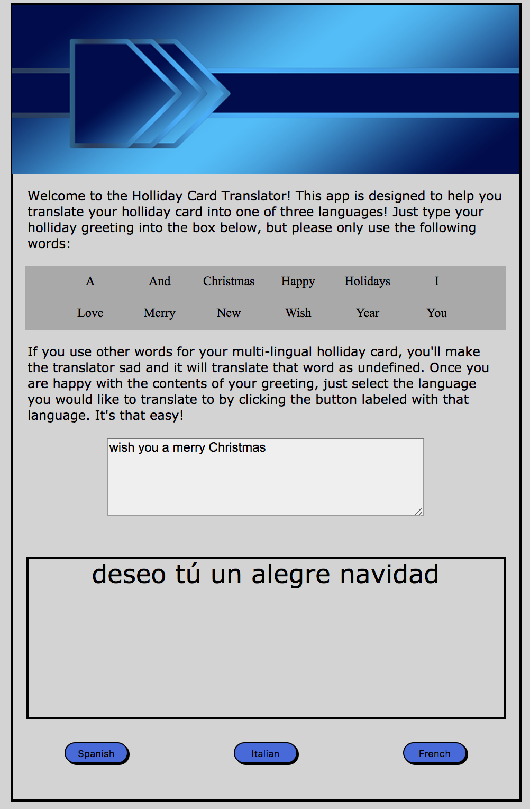

# Readme for Translator

### About this app

This app is a (relativly) simple translator.  I began by writing an object for each of the three languages that I wanted to translate from english.  Each object has a select few holiday words in english as a key and their respective translation.  Each button at the bottom of the app runs its own function.  Each function takes the words selected by the user and puts them in an array that runs through a for loop to change out each word for its paired translation. The result is then written to the DOM using a sperate print to DOM function.

 

### Provided Instructions
<a href="https://github.com/nss-nightclass-projects/exercise-vault/blob/master/JS_translator.md">Language Translator</a>

 

### How to use this app
1. Install `http-server` from `http://www.npmjs.com/package/htt-server`
2. In Terminal, navigate to the project folder and type: `http-server -p 8080`
3. In your browser, navigate to `http://localhost:8080`

 

Welcome to the Holliday Card Translator! This app is designed to help you translate your holliday card into one of three languages! Just type your holliday greeting into the box below, but please only use the following words:

* A
* And
* Christmas
* Happy
* Hollidays
* I
* Love
* Merry
* New
* Wish
* Year
* You

If you use other words for your multi-lingual holliday card, you'll make the translator sad and it will translate that word as undefined. Once you are happy with the contents of your greeting, just select the language you would like to translate to by clicking the button labeled with that language. It's that easy!

 

### Screenshot

